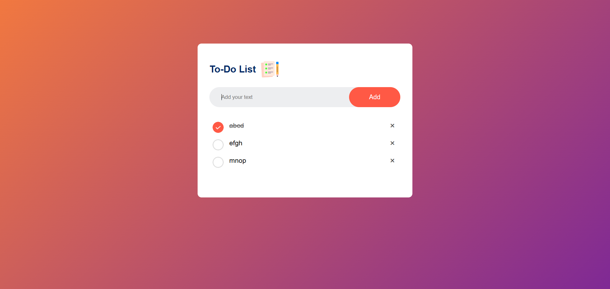

# 📝 To-Do List App

A simple and interactive **To-Do List Application** built using **HTML, CSS, and JavaScript**. This app helps you manage your daily tasks efficiently. It uses the browser's **Local Storage** to save your tasks, so your list remains safe even if you close or refresh the browser.

📸 Screenshot


## 🚀 Live Demo

[View Live Demo](https://rahul-kr1623.github.io/To-do-list/)

## 🌟 Features

- **Add Tasks:** Easily add new tasks to your list.
- **Mark as Completed:** Click on a task to strike it through and mark it as done.
- **Delete Tasks:** Remove unwanted tasks by clicking the '×' button.
- **Persistent Data:** Tasks are saved in **Local Storage**, so data is not lost on page refresh.
- **Responsive Design:** Works well on different screen sizes.
- **Custom UI:** Beautiful gradient background and custom check/uncheck icons.

## 🛠️ Technologies Used

- **HTML5** - For structure.
- **CSS3** - For styling (Flexbox, Gradients, Custom Checkboxes).
- **JavaScript** - For DOM manipulation and Local Storage logic.

## 📂 Project Structure

````bash
To-do-list/
├── images/
│   ├── icon.png
│   ├── checked.png
│   └── unchecked.png
├── index.html
├── style.css
├── script.js
└── README.md
````
## 🚀 How to Run Locally

If you want to run this project on your own machine:

1.  **Clone the repository**
    ```bash
    git clone [https://github.com/Rahul-kr1623/To-do-list.git](https://github.com/Rahul-kr1623/To-do-list.git)
    ```
2.  **Navigate to the project directory**
    ```bash
    cd To-do-list
    ```
3.  **Open `index.html`**
    Simply double-click `index.html` or open it with your preferred browser.

    ## 👨‍💻 Author

**Rahul Kumar**

* 📸 Instagram: [@rahulkr_1623](https://www.instagram.com/rahulkr_1623/)
* 🐙 GitHub: [@Rahul-kr1623](https://github.com/Rahul-kr1623)
* 💼 LinkedIn: [Rahul Kumar](http://www.linkedin.com/in/rahulkumar-web)

---
*Made with ❤️ and code.*
